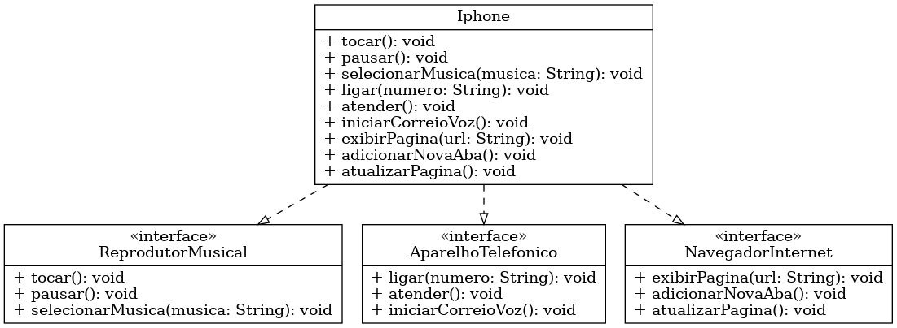

# Diagrama UML - Componente iPhone

Este diagrama representa o **componente iPhone** e suas funcionalidades principais.

## Interfaces
- **ReprodutorMusical**
  - `tocar()` – Inicia a reprodução de música.
  - `pausar()` – Pausa a reprodução atual.
  - `selecionarMusica(String musica)` – Seleciona a música a ser tocada.

- **AparelhoTelefonico**
  - `ligar(String numero)` – Realiza uma chamada telefônica para o número informado.
  - `atender()` – Atende uma chamada recebida.
  - `iniciarCorreioVoz()` – Inicia o correio de voz.

- **NavegadorInternet**
  - `exibirPagina(String url)` – Exibe a página informada.
  - `adicionarNovaAba()` – Abre uma nova aba no navegador.
  - `atualizarPagina()` – Atualiza a página atual.

## Classe
- **Iphone**
  - Implementa todas as três interfaces acima, reunindo as funcionalidades de **música**, **telefonia** e **navegação na web**.

